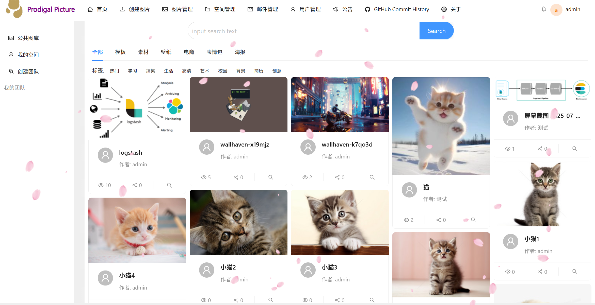
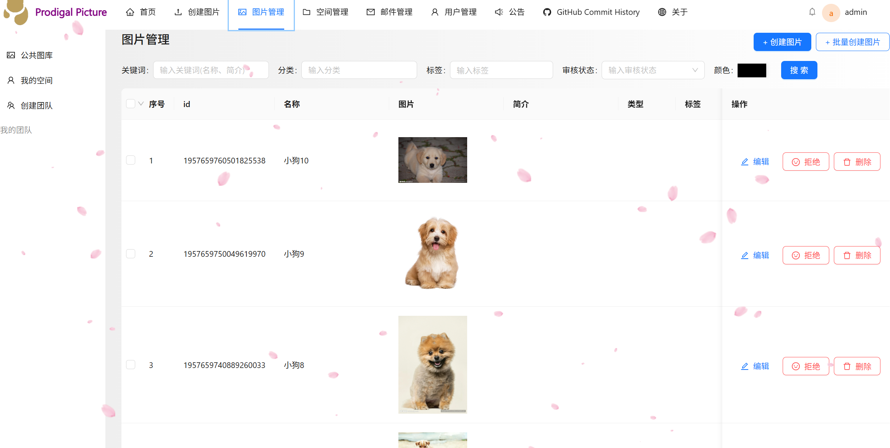
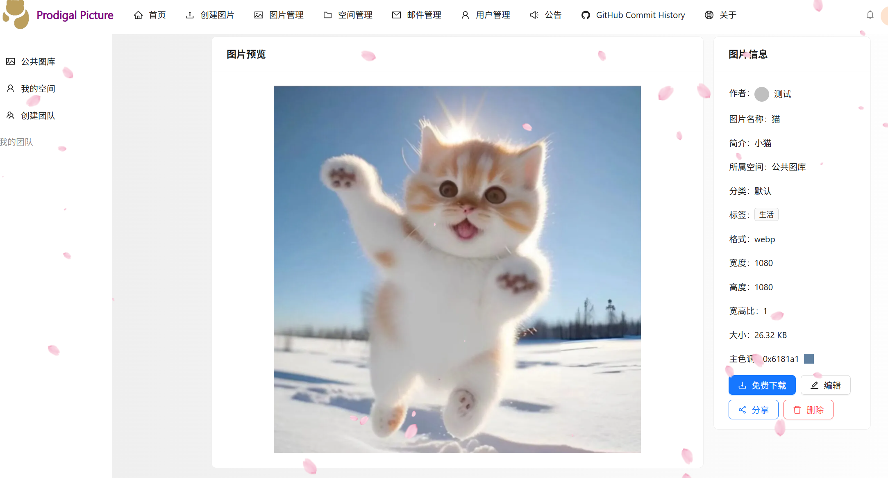
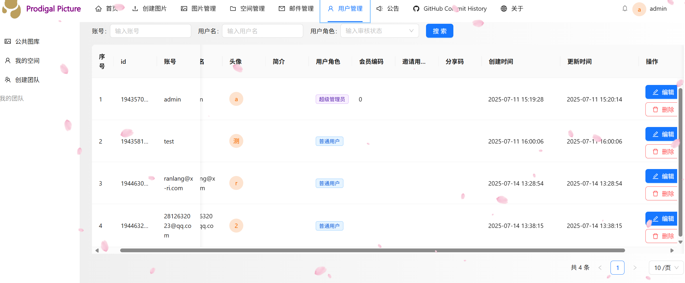
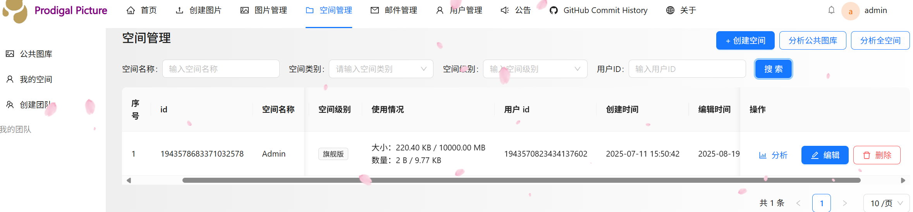
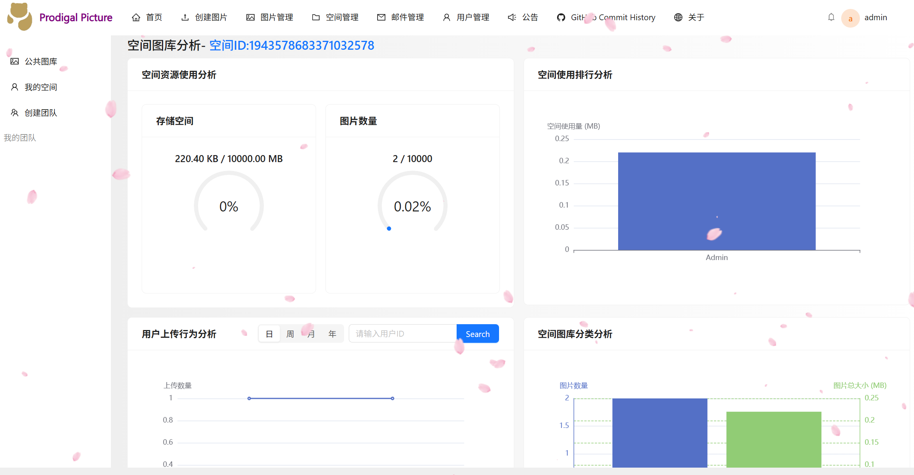

<h1 align="center">Prodigal Picture</h1>
<p align="center"><strong>企业级智能协同云图库平台</strong></p>

<p align="center">
  
  
  
  
  
</p>

---

## 平台简介

Prodigal Picture 是一站式智能云图库管理平台，涵盖 **公共图库、私有空间、团队协作** 三大核心模块。支持图片上传、多维检索、AI 扩图、审核流程、空间分析、邮件通知、SSE 实时推送等功能，满足个人到企业级团队的图片资产管理需求。

### 后端

- Spring Boot 3.4.3 + MySQL 8.0 + MongoDB + Redis + RabbitMQ
- MyBatis-Plus 3.5 + ShardingSphere 5.5 动态分表
- Sa-Token RBAC 多账号体系权限控制
- 腾讯云 COS 对象存储 + 数据万象图片处理
- SSE 服务端推送 + WebSocket 实时协同
- Knife4j + SpringDoc 自动接口文档

### 前端

- Vue 3.5 + TypeScript + Vite
- Ant Design Vue 4.x + Pinia 状态管理
- ECharts 5 可视化图表 + vue-echarts
- SSE 实时通知 + 暗色/浅色主题切换

---

## 系统架构

| 层级 | 技术/组件 |
|------|----------|
| **客户端** | Vue 3 + TypeScript  →  Ant Design Vue  →  Pinia / Vite |
| **协议** | HTTP / SSE |
| **网关** | REST API ｜ Sa-Token 鉴权 ｜ 接口限流 ｜ CORS 跨域 |
| **框架** | Spring Boot 3.x |
| **业务服务** | Controller → Service → Manager → Mapper |
|  | AOP 切面 ｜ 异常处理 ｜ 定时任务 ｜ RabbitMQ ｜ SSE 推送 |
| **数据存储** | MySQL 8.0（ShardingSphere 分表）｜ Redis（Caffeine 二级缓存）｜ MongoDB（邮件持久化）｜ 腾讯云 COS（万象图片处理） |
| **外部集成** | 阿里云百炼（AI 扩图）｜ 百度搜图（以图搜图）｜ Actuator（Prometheus 监控） |

---

## 核心功能

### 图片管理
- 本地上传、URL 抓取、批量导入
- 自动解析格式/尺寸/色调，生成缩略图与 WebP 格式
- 公共图库管理员审核机制（通过/拒绝 + 审核意见），审核结果邮件 + SSE 实时通知上传者
- 多维度检索：关键词、标签、分类、时间范围、颜色
- 百度以图搜图、主色调相似度排序
- 批量编辑图片（事务保障 + 线程池并发）

### 空间与协作
- 公共图库 / 私有空间 / 团队空间三种模式
- 空间等级体系（普通版 / 专业版 / 企业版），支持空间额度管控
- 团队空间成员管理，RBAC 权限控制
- WebSocket 多人实时协同编辑，Disruptor 无锁队列 + 编辑锁防冲突

### AI 能力
- 阿里云百炼大模型 AI 扩图（异步任务 + 轮询进度）
- 图片主色调自动提取（数据万象）

### 空间分析
- 空间用量 / 分类分布 / 标签统计
- 用户上传排行 / 大小排行 / 时间趋势
- ECharts 可视化图表展示

### 邮件系统
- 公告、告警、通知三种邮件类型
- HTML 富文本邮件内容，支持附件
- RabbitMQ 异步发送，削峰填谷不阻塞主流程
- MongoDB 持久化邮件记录，支持历史回溯
- SSE 实时推送邮件到达通知，在线用户即时感知
- 验证码邮件（注册/重置密码）
- MQ 消费幂等保障（Redis 去重）

### 系统管理
- 用户管理：注册/登录、密码修改与重置、个人信息编辑
- 图片管理：管理员审核、编辑、删除
- 空间管理：创建/编辑/分析空间
- 字典管理：系统枚举、配置项等键值数据维护
- 邮件管理：邮件草稿/发送/历史查询

### 基础设施
- 全局统一异常处理与响应封装
- 跨域配置 + Long 精度丢失解决（Jackson 序列化）
- Redis + Caffeine 二级缓存加速首页
- 暗色/浅色主题一键切换
- Actuator + Prometheus 应用监控

---

## 快速开始

### 环境要求

| 组件 | 版本 |
|------|------|
| JDK | 21+ |
| Maven | 3.6+ |
| Node.js | 18+ |
| MySQL | 8.0+ |
| Redis | 6.0+ |
| RabbitMQ | 3.9+ |
| MongoDB | 5.0+ |

### 后端启动

```bash
# 1. 初始化数据库（执行 sql/ 目录下的脚本）

# 2. 修改 system/src/main/resources/application.yml 中的数据库、Redis、RabbitMQ、COS 等配置

# 3. 启动
cd system
mvn spring-boot:run
```

### 前端启动

```bash
cd prodigal-picture-ui
npm install
npm run dev
```

访问 http://localhost:5173 即可打开前端页面。

---

## 在线体验

演示地址：*（待部署）*

演示账号：`test` / `123456`

---

## 效果展示

| 首页 | 图片管理 |
|------|----------|
|  |  |

| 图片详情 | 用户管理 |
|----------|----------|
|  |  |

| 空间管理 | 空间图库分析 |
|----------|-------------|
|  |  |

---
